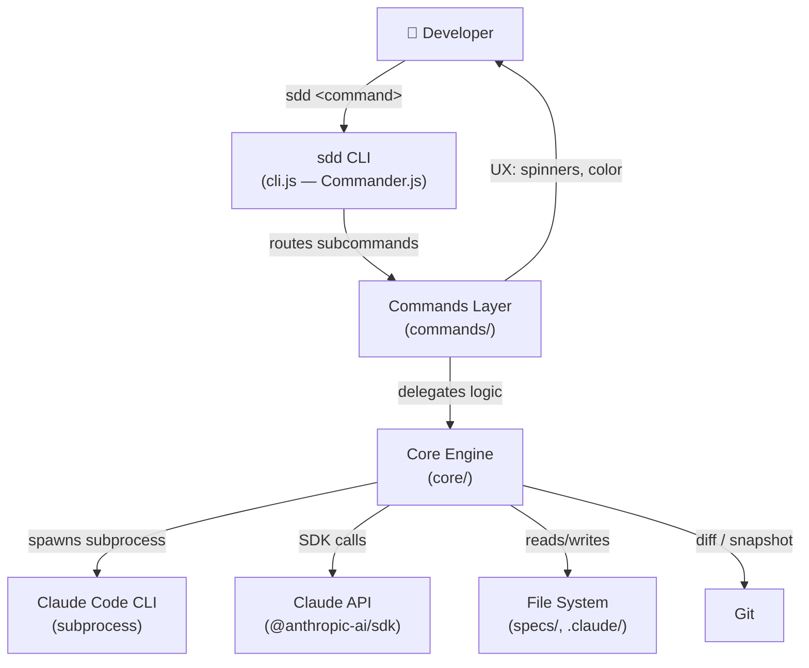
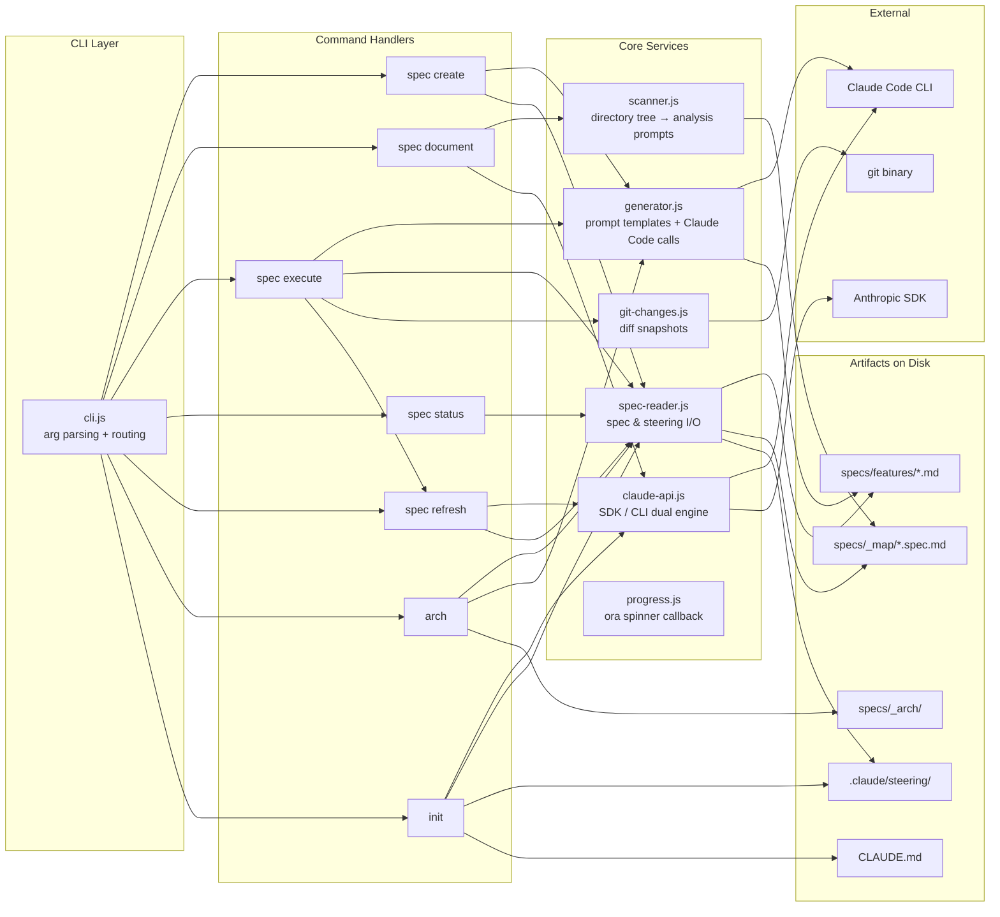
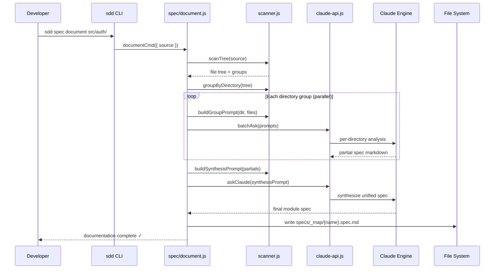
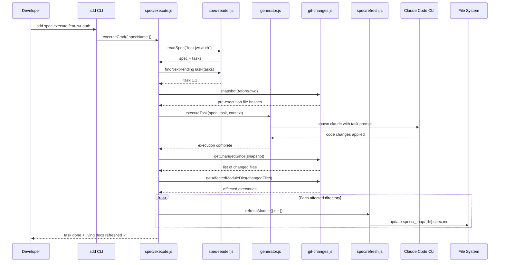
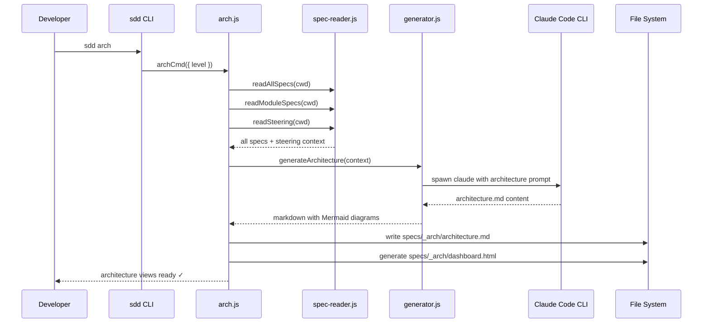
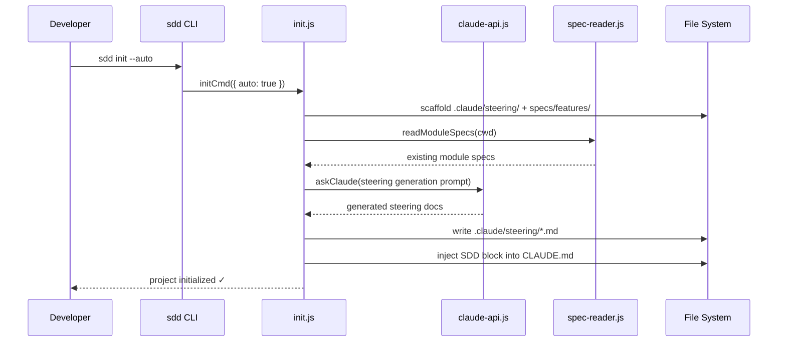
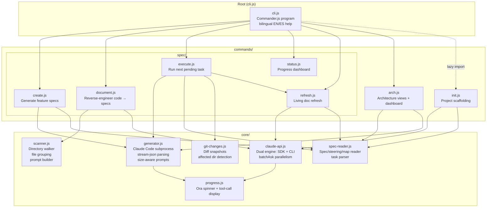

# Architecture — sdd-kit

> Auto-generated architecture views for the Spec-Driven Development Kit.

---

### SECTION: OVERVIEW


---

### SECTION: SERVICES


---

### SECTION: FLOWS

#### Flow: spec-create
```mermaid
sequenceDiagram
    participant Dev as Developer
    participant CLI as sdd CLI
    participant Create as spec/create.js
    participant Gen as generator.js
    participant Claude as Claude Code CLI
    participant FS as File System

    Dev->>CLI: sdd spec create "JWT auth" --size large
    CLI->>Create: createCmd({ description, size })
    Create->>Gen: detectMode(promptOnly)
    alt Claude Code available
        Create->>Gen: generateCreateSpec(description, size)
        Gen->>Claude: spawn claude --output-format stream-json
        Claude-->>Gen: streamed tool calls + text
        Gen-->>Create: spec content (requirements, design, tasks)
        Create->>FS: write specs/features/feat-jwt-auth/
    else promptOnly or unavailable
        Create->>FS: save prompt markdown for manual use
    end
    Create-->>Dev: spec files created ✓
```

#### Flow: spec-document


#### Flow: spec-execute-with-living-docs


#### Flow: arch-generation


#### Flow: init


---

### SECTION: MODULES


---

### SECTION: SUMMARY
{
  "system_name": "sdd-kit",
  "description": "Spec-Driven Development Kit for Claude Code — a CLI tool that generates, executes, and tracks feature specs using AI, with living documentation that stays in sync via git-diff-triggered refresh.",
  "components": [
    { "name": "cli.js", "type": "module", "description": "Commander.js entrypoint with bilingual help (EN/ES), subcommand routing, and flattened help display" },
    { "name": "spec/create.js", "type": "module", "description": "Generates feature spec files (requirements, design, tasks) from natural language descriptions via Claude Code" },
    { "name": "spec/document.js", "type": "module", "description": "Reverse-engineers existing source code into module specs via parallel per-directory analysis and synthesis" },
    { "name": "spec/execute.js", "type": "module", "description": "Executes the next pending task in a spec via Claude Code; triggers living-doc refresh on affected modules" },
    { "name": "spec/status.js", "type": "module", "description": "Renders a terminal progress dashboard with progress bars and task checklists — no AI calls" },
    { "name": "spec/refresh.js", "type": "module", "description": "Updates specs/_map/ living documentation for one or all directories; also exported for programmatic use" },
    { "name": "arch.js", "type": "module", "description": "Generates architecture.md with Mermaid diagrams and an HTML dashboard from all specs and steering docs" },
    { "name": "init.js", "type": "module", "description": "Scaffolds .claude/steering/ and specs/features/; optionally auto-generates steering docs; injects SDD block into CLAUDE.md" },
    { "name": "generator.js", "type": "service", "description": "Core AI integration via Claude Code CLI subprocess with stream-json output; size-aware prompt templates" },
    { "name": "claude-api.js", "type": "service", "description": "Dual-engine Claude client — auto-selects Anthropic SDK (fast, parallel) or CLI subprocess fallback; supports batching" },
    { "name": "scanner.js", "type": "service", "description": "Directory tree walker that groups files and builds batched analysis prompts for code-to-spec generation" },
    { "name": "spec-reader.js", "type": "service", "description": "Pure-function reader for all spec artifacts: feature specs, module maps, steering files, and task parsing" },
    { "name": "git-changes.js", "type": "service", "description": "Detects changed files via git diff before/after task execution; identifies affected module directories" },
    { "name": "progress.js", "type": "service", "description": "Creates an ora-spinner progress callback showing elapsed time and active Claude tool calls" },
    { "name": "Claude Code CLI", "type": "external", "description": "Anthropic Claude Code binary spawned as subprocess for spec generation and task execution" },
    { "name": "Anthropic SDK", "type": "external", "description": "@anthropic-ai/sdk for direct API calls — used by claude-api.js as the preferred fast engine" },
    { "name": "Git", "type": "external", "description": "Git binary used for diff snapshots and change detection in the living-docs refresh loop" }
  ],
  "features": [
    { "name": "Spec Creation", "status": "complete", "tasks_done": 0, "tasks_total": 0 },
    { "name": "Code Documentation", "status": "complete", "tasks_done": 0, "tasks_total": 0 },
    { "name": "Task Execution", "status": "complete", "tasks_done": 0, "tasks_total": 0 },
    { "name": "Living Docs Refresh", "status": "complete", "tasks_done": 0, "tasks_total": 0 },
    { "name": "Progress Dashboard", "status": "complete", "tasks_done": 0, "tasks_total": 0 },
    { "name": "Architecture Views", "status": "complete", "tasks_done": 0, "tasks_total": 0 },
    { "name": "Project Init + Steering", "status": "complete", "tasks_done": 0, "tasks_total": 0 },
    { "name": "Bilingual CLI (EN/ES)", "status": "complete", "tasks_done": 0, "tasks_total": 0 }
  ],
  "tech_stack": [
    "Node.js (ESM)",
    "Commander.js (CLI framework)",
    "@anthropic-ai/sdk (Claude API)",
    "Claude Code CLI (subprocess)",
    "chalk (terminal colors)",
    "ora (spinners)",
    "Mermaid (architecture diagrams)",
    "Git (change detection)"
  ],
  "key_decisions": [
    "Dual AI engine — SDK for speed/parallelism, CLI subprocess as fallback; auto-detected at runtime",
    "promptOnly fallback — every AI command degrades gracefully to a saved markdown prompt file",
    "Living docs loop — execute.js uses git diff post-task to auto-refresh only affected module specs",
    "Thin command layer — commands handle UX only (spinners, color), all logic lives in core/",
    "stream-json output — generator.js parses Claude Code tool calls incrementally for real-time progress",
    "Lazy loading — init.js is dynamically imported to avoid load cost unless invoked",
    "CLAUDECODE env cleanup — both claude-api.js and generator.js delete process.env.CLAUDECODE before spawning to bypass nested-session block"
  ]
}
