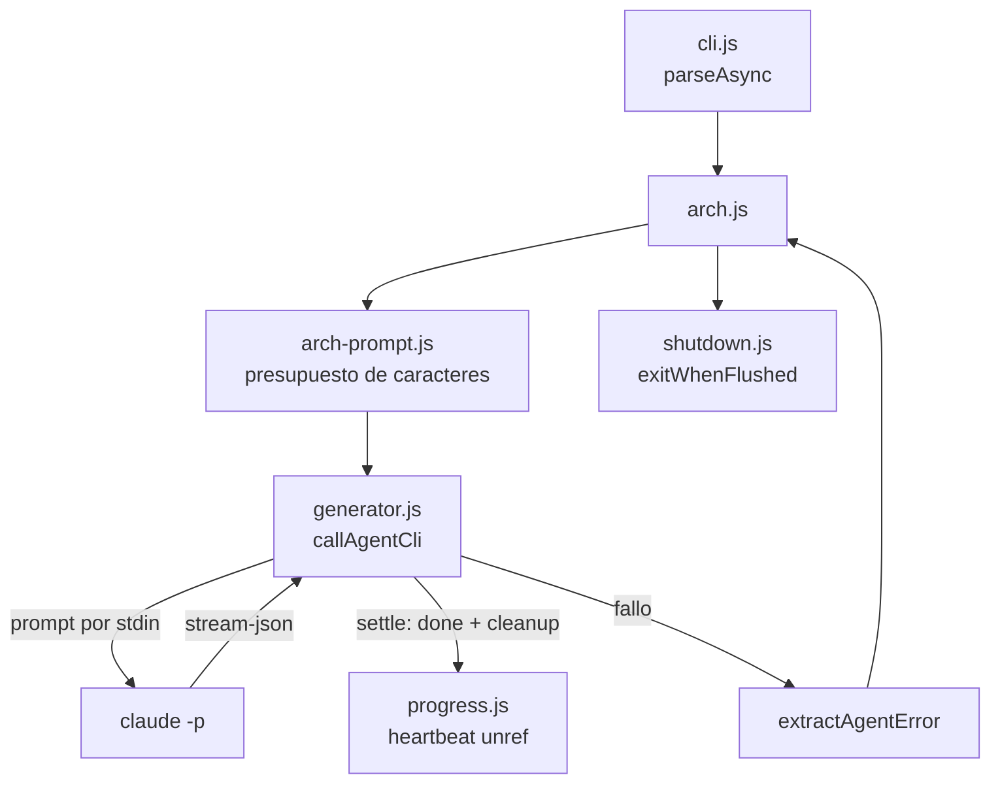

# Design: fix-arch-hang-and-corpus-budget

> Created: 2026-08-07 | Author: René Hechavarría <reneluishs@gmail.com>
> Feature: sdd arch no termina el proceso tras exito, y falla con corpus grandes sin decir por que

## Architecture Overview

## Components

| Archivo | Rol |
|---|---|
| `src/core/arch-prompt.js` | **Nuevo.** Construye el prompt de arch bajo un presupuesto de caracteres. Puro y testeable sin fs ni red. |
| `src/core/shutdown.js` | **Nuevo.** Drena stdout/stderr y sale. Red de seguridad del ciclo de vida del proceso. |
| `src/core/generator.js` | `settle()` unico para cerrar el hijo; `extractAgentError()`; prompt por stdin. |
| `src/core/progress.js` | Heartbeat con `unref()` y `stop()` idempotente. |
| `src/commands/spec/archive.js` | Archivado masivo por criterio (`--completed`, `--before`, `--dry-run`). |

## Key Decisions

### D1: presupuesto con priorizacion, no map-reduce

Las tres opciones eran map-reduce (resumir feature specs por lotes y agregar), presupuesto de tokens con priorizacion, o indice incremental cacheado.

Se eligio **presupuesto con priorizacion**. Razones:

- Encaja con el diseno actual: arch es **una sola llamada agentica** que escribe architecture.md ella misma. Map-reduce obligaria a un pipeline de N+1 llamadas y a reescribir el flujo entero.
- Costo: map-reduce sobre 332 specs son 332 llamadas extra. El presupuesto son 0.
- El agente conserva `Read`/`Glob`/`Grep`. En vez de fingir que el resumen es todo, el prompt le dice donde estan los specs completos en disco — que es el efecto util del map-reduce sin su costo.

El presupuesto por defecto es 300k caracteres (~75k tokens): holgado dentro de un modelo de 200k de contexto, dejando espacio para el system prompt, las tools y el loop agentico.

### D2: el tier de features degrada entero, no a la mitad

Recortar "los primeros N specs completos y el resto nada" produce un prompt incoherente: el modelo ve 40 features en detalle y cree que son todas. Degradar el tier completo (full -> summary -> headline) mantiene la representacion uniforme: los 332 specs siguen presentes, con menos detalle cada uno. Solo si ni los headlines caben se omiten specs, y entonces se omiten los mas antiguos (mtime) y se reporta cuantos.

### D3: el prompt viaja por stdin

`claude -p` sin valor lee el prompt de stdin (verificado contra Claude Code 2.1.224). argv esta limitado por ARG_MAX (1048576 en macOS y Linux, compartido con el environment), y un corpus de 1.69 MB lo excede: fallaria como E2BIG antes de llegar a la API. `opencode` mantiene el prompt posicional (`promptVia: 'argv'`), porque su soporte de stdin no esta verificado.

### D4: la senal de fin se emite al cerrar el hijo, no desde un evento

El bug original fue leer un campo que el CLI renombro (`cost_usd` -> `total_cost_usd`). Cualquier logica que dependa de la **forma** de un evento externo para liberar un recurso vuelve a romperse cuando el proveedor cambia el esquema. Por eso `settle()` emite `done` siempre al cerrar el proceso hijo, y el costo es un dato opcional dentro de ese evento, no su condicion.

Defensa en profundidad, porque un solo punto de fallo ya costo horas:
1. leer el campo correcto (con los viejos como fallback)
2. emitir `done` desde un unico `settle()` al cerrar el hijo
3. `unref()` en el heartbeat — un timer cosmetico nunca debe sostener el event loop
4. `onProgress.stop()` en `finally`
5. `exitWhenFlushed()` en cli.js como red de seguridad

### D5: salir explicitamente, drenando primero

Dejar que el event loop drene solo significa que cualquier handle suelto (un socket keepalive del SDK, un intervalo, un pipe sin consumir) convierte "comando terminado" en "la terminal no vuelve". `exitWhenFlushed()` sale explicitamente, pero **drena stdout/stderr antes**: en un pipe (`sdd arch | tee`) las escrituras son asincronas y un `process.exit()` inmediato truncaria el output.

## Notes

`specs/archived/` ya estaba excluido de todos los lectores (`RESERVED_SPEC_DIRS` en spec-reader.js), asi que el archivado masivo no necesito tocar el corpus: solo mover directorios.

`readSpecAt()` ahora devuelve `mtime` (el mas reciente de los archivos del spec) porque el presupuesto necesita un criterio de antiguedad para decidir que se omite primero.
