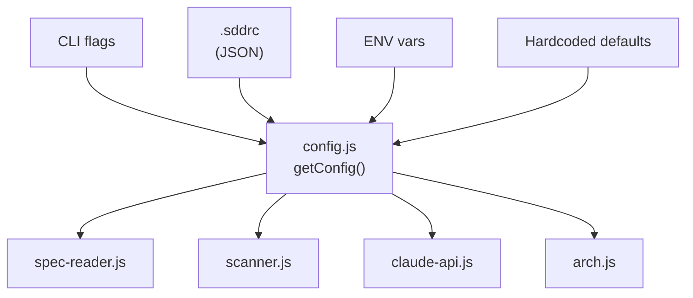

# Design: feat-config

> Created: 2026-03-23 | Author: Hector Curbelo Barrios <hcurbelo@gmail.com>
> Feature: Configuracion .sddrc: sistema de config con defaults, override por archivo y env vars

## Architecture

Nuevo modulo `src/core/config.js` que centraliza toda la configuracion.



## Schema

```json
{
  "specs_dir": "specs/features",
  "modules_dir": "specs/_map",
  "steering_dir": ".claude/steering",
  "arch_dir": "specs/_arch",
  "concurrency": 4,
  "max_file_size": 51200,
  "max_depth": 8
}
```

## API

```javascript
import { getConfig } from './core/config.js';

const config = getConfig(cwd);  // lazy, cached per cwd
config.specsDir;     // resolved path
config.modulesDir;
config.steeringDir;
config.archDir;
config.concurrency;
config.maxFileSize;
config.maxDepth;
```

## Key Decisions

- **JSON plano** para `.sddrc` — sin dependencias extra (no YAML, no TOML)
- **Lazy loading** — config se lee una vez y se cachea
- **No validacion estricta** — keys desconocidos se ignoran (forward-compatible)
- **getConfig(cwd)** acepta cwd para buscar `.sddrc` en el directorio correcto
