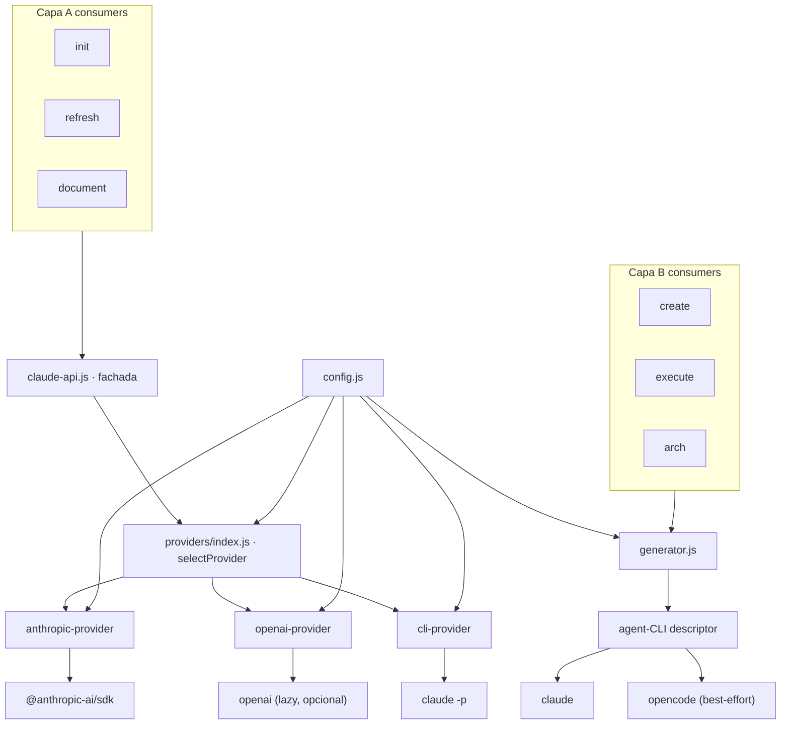

# Design: feat-multi-llm-provider

> Created: 2026-06-26 | Author: Hector Curbelo Barrios <hcurbelo@gmail.com>

## Arquitectura

## Componentes

### Contrato de proveedor (`src/core/providers/provider.js`)
`{ name: string, isAvailable(): boolean, async ask(prompt, { maxTokens, cwd }): string }`.

### Proveedores
- **anthropic-provider** — mueve aquí el `askSdk` actual. Cliente lazy `@anthropic-ai/sdk`; modelo de `config.model` (default `claude-sonnet-4-6`). Timeout 5 min, valida prefijo `sk-`.
- **openai-provider** — `openai` lazy/opcional. `new OpenAI({ baseURL, apiKey })`, `chat.completions.create({ model, messages, max_tokens })`. `baseURL`/`apiKey`/`model` de config. Cubre OpenAI, Ollama (`/v1`, key dummy), vLLM.
- **cli-provider** — mueve aquí el `askCli` actual (`claude -p … --output-format text`). Modelo = alias Claude Code de `config.agent_model`/`config.model`.

### Selección (`src/core/providers/index.js`)
`selectProvider(cwd)`:
1. `config.provider` explícito → ese proveedor (`openai`/`ollama`/`vllm` → openai-provider con su `base_url` por defecto).
2. `auto` → `ANTHROPIC_API_KEY`?anthropic : `OPENAI_API_KEY`?openai : claude-cli.
Cachea como hoy (`_mode`).

### Fachada (`src/core/claude-api.js`)
`detectEngine`→nombre del proveedor seleccionado; `getEngineName`→etiqueta legible; `askClaude(prompt,opts)`→`selectProvider().ask`; `batchAsk` conserva el worker-pool (concurrency de config), solo cambia la llamada interna. Firmas idénticas.

### CLI agéntico (`src/core/generator.js`)
Descriptor: `{ command, versionArgs, buildArgs({ prompt, model, allowedTools, maxBudget }) }`.
- `claude`: args actuales (`-p`, `--allowedTools`, `--output-format stream-json`, `--verbose`, `--max-budget-usd`). Parser stream-json sin cambios.
- `opencode`: best-effort `opencode run <prompt> --model <model>` (texto plano). **Verificar flags reales**; gateado por disponibilidad.
`isAgentCliAvailable(cmd)` y `detectMode` usan `config.agent_cli`. Si el CLI no responde a `versionArgs` → `Mode.PROMPT`.

## Config (`src/core/config.js`)
Nuevos defaults: `provider: 'auto'`, `model: ''` (vacío = default por proveedor), `base_url: ''`, `api_key_env: ''`, `agent_cli: 'claude'`, `agent_model: 'sonnet'`. Mismos `_sources`.

## Decisiones clave
- **OpenAI-compatible unificado:** un proveedor con `baseURL` cubre OpenAI/Ollama/vLLM → menos código, más endpoints.
- **Anthropic en SDK nativo:** no se usa shim OpenAI para Claude (precisión y features).
- **Lazy + opcional para `openai`:** instalaciones sin OpenAI no cargan la dependencia; error accionable si falta.
- **Default model resuelto por proveedor:** `model` vacío evita acoplar el config a un ID concreto.
