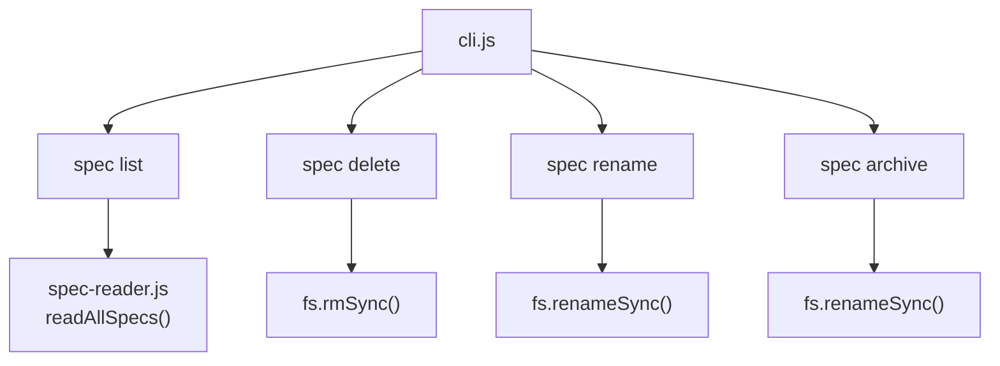

# Design: feat-spec-lifecycle

> Created: 2026-03-23 | Author: Hector Curbelo Barrios <hcurbelo@gmail.com>
> Feature: Lifecycle de specs: comandos list, delete, rename, archive

## Architecture

Cuatro nuevos command handlers bajo `src/commands/spec/`, registrados en `src/cli.js`.

## Commands API

### sdd spec list
- No arguments
- Output similar a `sdd spec status` pero mas compacto (una linea por spec)
- Reutiliza `readAllSpecs()` de spec-reader.js

### sdd spec delete <name>
- Requiere confirmacion via stdin (readline)
- `--force` salta confirmacion
- Borra `specs/features/{name}/` recursivamente

### sdd spec rename <old> <new>
- Renombra directorio `specs/features/{old}/` -> `specs/features/{new}/`
- Lee cada .md y reemplaza el nombre viejo en headers

### sdd spec archive <name>
- Mueve `specs/features/{name}/` -> `specs/archived/{name}/`
- Con `--restore`: inverso
- `specs/archived/` se crea si no existe

## Key Decisions

- **readline para confirmacion** — no agregar dependencias, usar Node built-in
- **No recursive archive** — solo un nivel, sin subdirectorios dentro de specs/archived/
- **Headers update en rename** — solo primera linea de cada .md que contenga el nombre viejo
