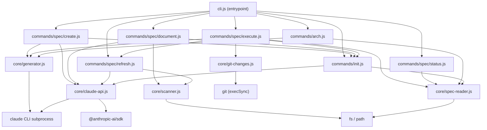

Here is the markdown content for `specs/src.spec.md`:

````markdown
# Spec: sdd-kit — Spec-Driven Development CLI for Claude Code

## Purpose
`sdd-kit` is a CLI tool (`sdd`) that brings spec-driven development workflows to Claude Code projects. It generates feature specs from natural language descriptions, reverse-engineers existing codebases into living module documentation, executes spec tasks via Claude Code, and maintains a self-updating architecture view — all anchored around a structured spec artifact system on disk.

## Architecture



## Modules

**`src/cli.js` (root)** — CLI entrypoint. Defines the `sdd` program via Commander.js, declares all subcommands (`spec create`, `spec document`, `spec execute`, `spec refresh`, `spec status`, `arch`, `init`), handles bilingual (EN/ES) help text via locale detection, and flattens nested command trees for a clean `--help` display. Pure routing — no business logic.

**`src/commands/`** — Thin orchestration layer. Each file maps one-to-one to a CLI subcommand. Commands handle all terminal UX (spinners via `ora`, color via `chalk`, progress bars) and delegate AI and file operations to `core/`. The `init.js` command also exports `refreshSteering()`, which is called by other commands after spec-modifying operations.

**`src/core/`** — Engine layer. Contains all AI integration, file I/O, and analysis logic. Intentionally free of terminal UX concerns. `spec-reader.js` is pure (no side effects); all other modules may spawn subprocesses or write files.

## Key Interfaces

```js
// Spec generation and task execution
generateCreateSpec(description, name, size, cwd)
executeTask(specName, taskId, cwd)
generateArchitecture(level, flow, cwd)

// Claude AI client (auto-selects SDK or CLI)
askClaude(prompt, opts)
batchAsk(items, opts)
detectEngine()

// Spec file reading (pure, no side effects)
readAllSpecs(cwd)
readSpec(cwd, specName)
readModuleSpecs(cwd)
readSteering(cwd)
findNextPendingTask(tasks)

// Directory scanning for reverse-engineering
scanTree(rootPath)
buildGroupPrompt(dirName, fileContents)
buildSynthesisPrompt(specName, sourcePath, partialSpecs)

// Git-based living doc refresh
snapshotBefore(cwd)
getChangedSince(snapshot, cwd)
getAffectedModuleDirs(changedFiles)

// Command entry points
createCmd({ description, name, size, promptOnly, cwd })
documentCmd({ source, name, promptOnly, cwd })
executeCmd({ specName, taskId, dryRun, promptOnly, cwd })
refreshCmd({ dir, promptOnly, cwd })
refreshModule({ dir, cwd })
statusCmd({ specName, verbose, cwd })
archCmd({ level, flow, output, promptOnly, cwd })
initCmd({ auto, cwd })
refreshSteering({ cwd, silent, structuralChange })
```

## Data Flow

**Feature spec creation:** User description → `createCmd` → `generator.js` spawns `claude` CLI subprocess with size-aware prompt template → structured spec written to `specs/features/<name>.md` → `refreshSteering()` updates `.claude/steering/`.

**Code documentation:** Source directory → `documentCmd` → `scanner.js` walks tree and groups files by directory → `batchAsk()` sends parallel per-directory prompts to Claude → partial specs collected → `buildSynthesisPrompt()` synthesizes → unified spec written to `specs/_map/<name>.spec.md`.

**Task execution:** `executeCmd` → `snapshotBefore()` captures git state → `readSpec()` finds next pending task → `generator.js` runs Claude Code on the task → `getChangedSince()` diffs post-execution → `getAffectedModuleDirs()` identifies touched modules → `refreshModule()` updates relevant `specs/_map/` entries → `refreshSteering()` updates steering docs.

**Status dashboard:** `statusCmd` → `readAllSpecs()` + `readModuleSpecs()` → pure terminal rendering (no AI calls).

**Architecture view:** `archCmd` → `readAllSpecs()` + `readSteering()` + `readModuleSpecs()` → `generateArchitecture()` via Claude Code → Mermaid + HTML dashboard written to `architecture.md`.

## Dependencies

| Dependency | Role |
|---|---|
| `commander` | CLI argument parsing and subcommand routing |
| `chalk` | Terminal color output across commands and core |
| `ora` | Spinner UX for long-running AI operations |
| `@anthropic-ai/sdk` | Primary Claude engine in `claude-api.js` (SDK mode) |
| `claude` CLI binary | Fallback/subprocess Claude engine; used by `generator.js` for structured streaming |
| `child_process` | Spawning `claude` subprocesses and running `git` commands |
| Node.js `fs`, `path`, `util` | All file I/O and path resolution |

## Notes

- **Dual Claude callers**: `generator.js` uses `stream-json` output format with incremental tool-call parsing for structured spec generation; `claude-api.js` uses plain `text` format for simpler Q&A-style invocations. Both delete `process.env.CLAUDECODE` before spawning to avoid Claude Code's nested-session block.
- **`promptOnly` fallback**: Every AI-dependent command degrades gracefully — if no Claude engine is available, a markdown prompt file is saved for manual use.
- **Living docs loop**: `execute.js` uses git diff post-task to detect changed module directories and triggers targeted `refreshModule()` calls, keeping `specs/_map/` automatically in sync without full rescans.
- **`refreshModule` dual role**: The same function is both the implementation of `sdd spec refresh` and an internal utility called programmatically by `execute.js` after task completion.
- **`refreshSteering` ownership**: Exported from `init.js` and called by `create.js`, `document.js`, and `execute.js` — `init.js` is the single owner of steering doc logic.
- **Known bug**: `generator.js` contains a truncated `DOCUMENT_PROMPT` string (ends mid-expression with `` specs/${spe ``), which may cause silent failures in document mode when using the generator path directly.
- **Spec artifact layout**: `specs/features/` holds feature specs; `specs/_map/` holds per-module living docs; `.claude/steering/` holds project-level steering documents consumed by Claude Code sessions.
````